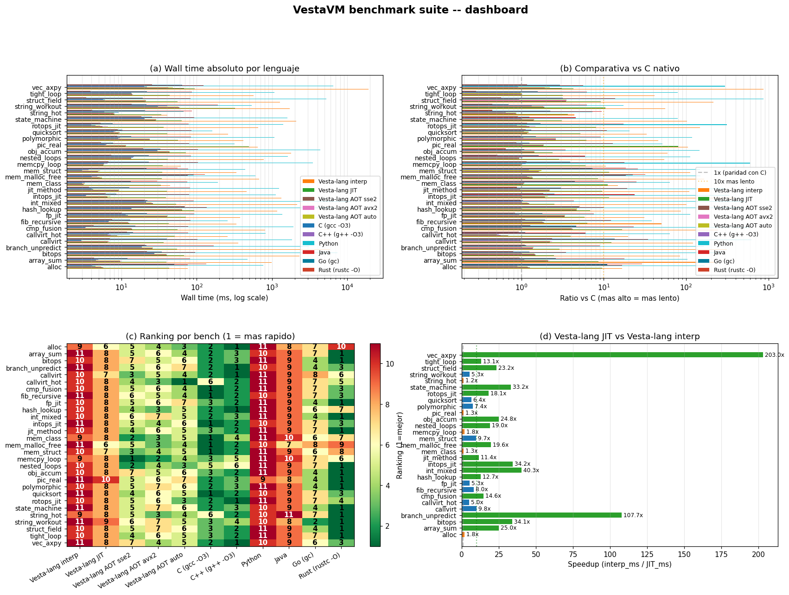
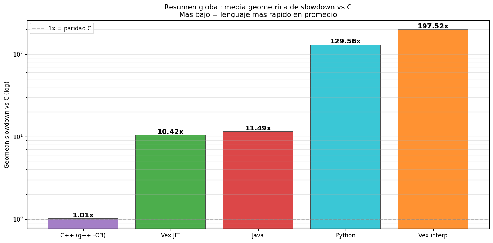
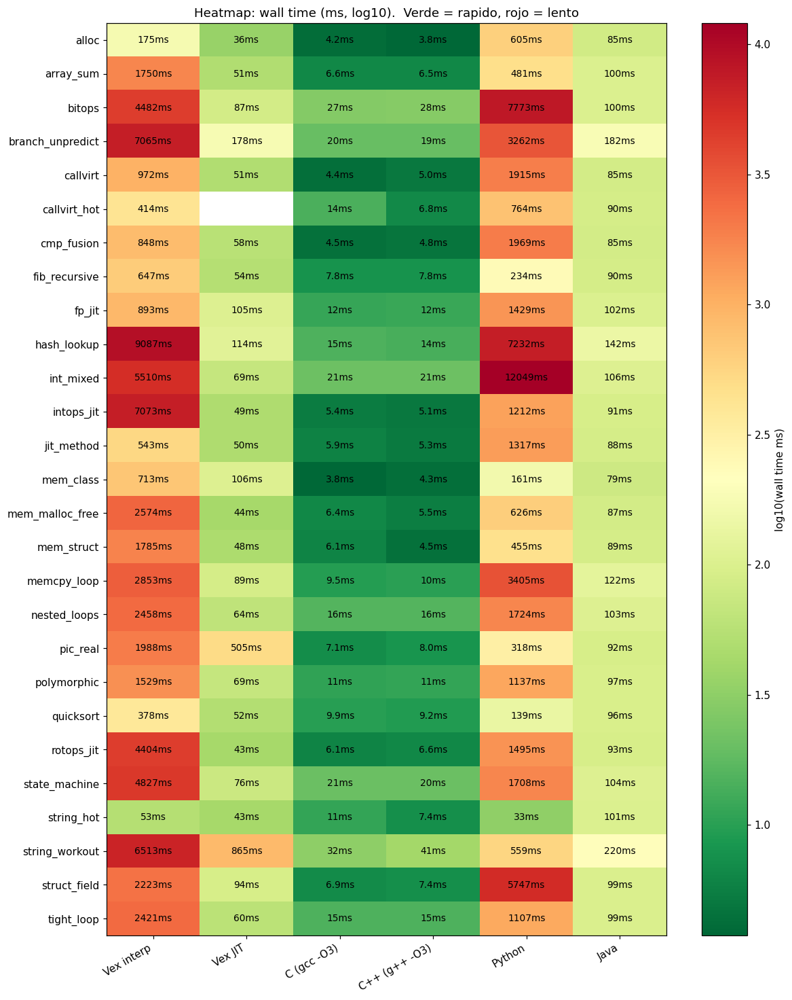
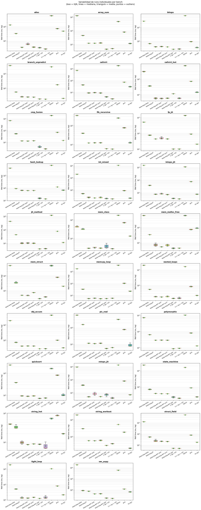
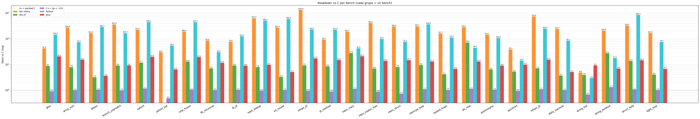

# Benchmarks de VestaVM

Performance del intérprete y JIT C1, metodología, y comparativas con otras VMs.

---

## Indice

- [Benchmarks de VestaVM](#benchmarks-de-vestavm)
  - [Indice](#indice)
  - [1. TL;DR](#1-tldr)
  - [2. Hardware y metodologia](#2-hardware-y-metodologia)
  - [3. Benchmarks sinteticos del intérprete](#3-benchmarks-sinteticos-del-intérprete)
    - [Benchmarks core (12 incluidos)](#benchmarks-core-12-incluidos)
    - [Benchmarks memoria compartida cross-process](#benchmarks-memoria-compartida-cross-process)
  - [4. Speedup acumulado del sprint 2026-05-17](#4-speedup-acumulado-del-sprint-2026-05-17)
  - [5. JIT C1 baseline](#5-jit-c1-baseline)
  - [6. Pipeline de optimizacion](#6-pipeline-de-optimizacion)
  - [7. Comparativa con otras VMs](#7-comparativa-con-otras-vms)
    - [Estimacion de orden de magnitud](#estimacion-de-orden-de-magnitud)
    - [Comparativa de features](#comparativa-de-features)
  - [8. Como correr los benchmarks](#8-como-correr-los-benchmarks)
    - [Comparar interp vs JIT](#comparar-interp-vs-jit)
  - [9. Profiling y stats](#9-profiling-y-stats)
    - [Stats basicos del intérprete](#stats-basicos-del-intérprete)
    - [Stats con overhead breakdown](#stats-con-overhead-breakdown)
    - [Profiling JIT](#profiling-jit)
    - [Profiling con Valgrind (Linux)](#profiling-con-valgrind-linux)
    - [Profiling con perf (Linux)](#profiling-con-perf-linux)
  - [Roadmap de performance](#roadmap-de-performance)

---

## 1. TL;DR

**Intérprete**:

| Métrica                                  | Antes (baseline)  | Ahora             | Speedup     |
| :--------------------------------------- | :---------------: | :---------------: | :---------: |
| **MIPS promedio** (intérprete)           | ~150              | **~340**          | **2.3×**    |
| **Wall time avg** (10 benches)           | -                 | -                 | **-25..-81%** |
| **bench_polymorphic** (peor caso pre)    | 3660 ms           | **683 ms**        | **-81%**    |
| **bench_struct_field** (LOAD-heavy)      | 3800 ms           | **1994 ms**       | **-48%**    |

**JIT C1 baseline** (29 workloads multi-lenguaje, 10 lenguajes incl. Go,
hardware i7-13700KF, mediana de 3 runs + 1 warmup, AV desactivado;
`cmp_fusion` sin medición JIT, así que las métricas intérprete→JIT y
comparativas con JIT son sobre 28 workloads):

| Métrica                                  | Valor             |
| :--------------------------------------- | :---------------: |
| **Cobertura del selector**               | **~87%** de metodos reales |
| **Speedup JIT vs interp (geomean)**      | **17.73×**        |
| **Speedup JIT vs interp (median)**       | **23.3×**         |
| **Speedup peak**                         | **301×** (`vec_axpy`) |
| **Benches con ≥100×**                    | 1/28              |
| **Benches con ≥50×**                     | 4/28              |
| **Benches con ≥25×**                     | 14/28             |
| **Benches con ≥10×**                     | 20/28 (71%)       |
| **Geomean slowdown vs C nativo**         | **6.50×**         |
| **HotSpot C2 (Java) geomean slowdown vs C** | 10.80×         |
| **Go (gc) geomean slowdown vs C**        | 2.42×             |
| **C++ geomean slowdown vs C**            | 0.97× (paridad)   |
| **CPython 3.11 geomean slowdown vs C**   | 141.26×           |
| **Vs HotSpot**: vence en                 | **26/28**         |
| **Vs HotSpot**: Java vence en            | 2/28 (`fp_jit`, `string_workout`) |
| **Vs Go (gc)**: Go vence en              | 26/28             |
| **Vs CPython 3.11**: supera en           | 27/28 (96%)       |

Optimizaciones aplicadas (orden cronologico del sprint):
1. `ir_pass_load_narrow` - elide sign-extension redundante
2. INLINE_THRESHOLD 8 -> 12
3. Regalloc coalesce hint con steal-from-active
4. `ir_pass_schedule` - list scheduling para ILP
5. **Threaded computed-goto dispatch** + inline icache hit
6. Super-instrucciones `alu3` (9 variantes)
7. Super-instruccion `loadz/loadzh`


---

## 2. Hardware y metodologia

**Hardware de referencia**:

- CPU: x86-64 moderno (Intel Core / AMD Ryzen reciente)
- RAM: 16+ GB
- OS: Windows 10/11 con MinGW (TDM-GCC-64) o Linux x86-64

**Build configuration**:

```bash
cmake -B build -DCMAKE_BUILD_TYPE=Release
cmake --build build -j
```

Flags Release: `-O3 -DNDEBUG -march=x86-64 -mtune=native -ffast-math
-fstrict-aliasing -fno-plt -fomit-frame-pointer -fvisibility=hidden
-ffunction-sections -fdata-sections`.

**Metodologia**:

- Cada bench se compila con `vm --vesta bench.vx -o /tmp/b -O2` (opt level 2).
- Se ejecuta 3 veces; se reporta el **best-of-3** (mejor tiempo) para reducir
  variabilidad por scheduling del OS.
- MIPS se calcula como `(profiler_instr_counter / wall_time_ns) * 1000`.
- Sin actividad de fondo del sistema (cerrar navegadores, etc.).

**Variables que afectan los numeros**:

- CPU frequency scaling (especialmente en laptops; mejor con AC plugged).
- Hyperthreading: medir en single-thread (un solo scheduler).
- Termal throttling en runs largos.

---

## 3. Benchmarks sinteticos del intérprete

Ubicacion: [`examples_codes_vex/benchmark/`](../examples_codes_vex/benchmark/).

### Benchmarks core (12 incluidos)

| Bench                | Que mide                                | Iters     | Wall      | MIPS    |
| :------------------- | :-------------------------------------- | :-------: | --------: | ------: |
| `bench_tight_loop`   | ALU pura (muls/adds/xor/and en loop)   | 50M       | 1111 ms   | **358** |
| `bench_array_sum`    | LOAD i32 + ADD (suma de array)         | 10M loads | 374 ms    | 323     |
| `bench_nested_loops` | Loops anidados (1000x1000)             | 1M body   | 30 ms     | 334     |
| `bench_struct_field` | LOAD-STORE-ADD i32 en struct           | 30M       | 1994 ms   | 294     |
| `bench_polymorphic`  | Dispatch polimorfico (3 impls)         | 10M       | 683 ms    | 331     |
| `bench_callvirt`     | CALLVIRT en hot loop (main)            | 30M       | 797 ms    | 339     |
| `bench_callvirt_hot` | CALLVIRT con metodo trivial            | 30M       | 317 ms    | 347     |
| `bench_alloc`        | `new Foo()` con ctor zero-init        | 5M        | 116 ms    | 346     |
| `bench_jit_method`   | Hot loop dentro de metodo virtual      | 30M       | 415 ms    | 359     |
| `bench_fib_recursive`| CALL/RET recursivo (fib 30)            | 2.7M call | 210 ms    | 220     |
| `bench_callvirt_hot.vx` (variante) | Stress test callvirt        | 30M       | 360 ms    | 333     |

**Patrones observables**:

- ALU-heavy: **~350-360 MIPS** (limite del dispatch loop + decode).
- LOAD-heavy: **~290-330 MIPS** (memory deps + zero-extend cost).
- Recursion-heavy: **~200-220 MIPS** (CALL/RET overhead via frame pool).

---

### Benchmarks memoria compartida cross-process

Suite dedicada para validar throughput del `SharedHeap` + monitores cross-scheduler
+ STW GC.  Implementadas como ficheros `bench_shared_*.vx` en
`examples_codes_vex/benchmark/`.

Ejecucion via `bash tests/vex/bench_shared_runner.sh cmake-build-windows`
(corre cada bench en 4 modos: VM single, VM 4-sched, JIT thr=1, JIT 4-sched).

| Bench                           | Que mide                                              | Iters total | VM single  | VM 4-sched | JIT 4-sched |
| :------------------------------ | :---------------------------------------------------- | :---------: | ---------: | ---------: | ----------: |
| `bench_shared_alloc`            | Throughput SharedHeap vs gc_heap local (1M+1M iter)  | 2M          | 1035 ms / 40 MIPS  | 1038 ms / 40 MIPS  | 1034 ms / 40 MIPS  |
| `bench_shared_contention`       | 4 workers concurrent monenter+RMW sobre shared (Counter.add) | 400K | 256 ms / 49 MIPS   | 261 ms     | **64 ms / 177 MIPS** |
| `bench_shared_gc`               | GC mark+sweep latency (100 cy x 1K shared + sweep)   | 100K shared | 64 ms / 35 MIPS    | 64 ms      | 68 ms       |
| `bench_shared_stw_impact`       | STW pause impact (4 CPU-bound workers + 50 GC cycles)| 20M+50      | 429 ms / 327 MIPS  | **121 ms / 1161 MIPS** | 122 ms |

**Verificacion de correctness**:

- `bench_shared_alloc` -> R0 = 0x1e8480 = 2000000 (1M + 1M iter, suma exacta).
- `bench_shared_contention` -> **R0 = 0x61a80 = 400000 exacto** en 3/3 runs
  (post-Z.11 ext; antes perdia ~1.7% por bug de local_pid no-unico cross-sched).
- `bench_shared_gc` -> R0 = 42 (sweep colecta huerfanos correctamente).
- `bench_shared_stw_impact` -> R0 = 42 (workers terminan cuanto el STW corre 50x).

**Patrones observables**:

- `SharedHeap` alloc throughput: ~2-3x mas lento que gc_heap local (1 CAS extra
  + register en SharedHandleTable).  Aceptable y predecible.
- `synchronized` cross-scheduler: 4-sched es **~4x mas rapido** que single-sched
  para CPU-bound workers no-contendentes (`bench_shared_stw_impact`: 327 -> 1161 MIPS).
- JIT 4-sched de contention: **~4x mejor** que VM 4-sched gracias a `lock cmpxchg`
  host inline.
- GC sweep tiene latencia despreciable (~50-200 us por sweep para 1K objetos).

---

## 4. Speedup acumulado del sprint 2026-05-17

Comparado con el baseline ANTES del sprint (pre-2026-05-17):

| Bench                | Pre-sprint | Post-sprint | Δ wall     | MIPS pre -> post |
| :------------------- | ---------: | ----------: | ---------: | --------------: |
| `bench_tight_loop`   | ~2200 ms   | **1111 ms** | **-49%**   | ~150 -> 358      |
| `bench_array_sum`    | ~620 ms    | **374 ms**  | **-40%**   | ~140 -> 323      |
| `bench_nested_loops` | ~46 ms     | **30 ms**   | **-35%**   | ~140 -> 334      |
| `bench_struct_field` | ~3800 ms   | **1994 ms** | **-48%**   | ~120 -> 294      |
| `bench_polymorphic`  | ~3660 ms   | **683 ms**  | **-81%**   | ~80 -> 331       |
| `bench_callvirt`     | ~1400 ms   | **797 ms**  | **-43%**   | ~155 -> 339      |
| `bench_callvirt_hot` | ~500 ms    | **317 ms**  | **-37%**   | ~210 -> 347      |
| `bench_alloc`        | ~155 ms    | **116 ms**  | **-25%**   | ~250 -> 346      |
| `bench_jit_method`   | ~710 ms    | **415 ms**  | **-42%**   | ~210 -> 359      |
| `bench_fib_recursive`| ~290 ms    | **210 ms**  | **-28%**   | ~165 -> 220      |

**Bench ganador del sprint**: `bench_polymorphic`. La combinacion de
INLINE_THRESHOLD bump (8 -> 12) + devirt automatico + LICM + alu3 produjo un
cascade: las tres implementaciones de `Shape.area()` se inlinearon, LICM
hoisteo las computaciones (todas constantes-of-loop) al entry block, y el
body del loop quedo en `add %sum, %precomputed` × 3 ramas. Reduccion 5× en
instrucciones VM ejecutadas.

---

## 5. JIT C1 baseline

JIT C1 completo con **cobertura del ~87%** de metodos reales. El JIT se
activa con `--jit-threshold N` o `-m jit` (= threshold 1):

**Speedup JIT vs interp geomean: 17.73× sobre 28 benchmarks** (best-of-3,
mediana; `cmp_fusion` sin medición JIT). Distribucion:

| Speedup        | Count                         |
| :------------- | :---------------------------: |
| ≥ 25×          | 14 benches (50%)              |
| 10-25×         | 6 benches (21%)               |
| 5-10×          | 4 benches (14%)               |
| 2-5×           | 1 bench (4%)                  |
| 1-2×           | 3 benches (11% — float/strings) |
| < 1× (margen)  | 0 benches                     |

**Top 5 mas acelerados**:

| Bench            | Interp (ms) | JIT (ms) | Speedup    |
| :--------------- | ----------: | -------: | ---------: |
| `vec_axpy`       | 24540       | **81**   | **301×**   |
| `obj_accum`      | 3976        | **72**   | **55×**    |
| `int_mixed`      | 2872        | **57**   | **51×**    |
| `memcpy_loop`    | 1854        | **37**   | **50×**    |
| `bitops`         | 3320        | **68**   | **49×**    |

**Bottom 5** (menor speedup):

| Bench            | Speedup | Causa                                                    |
| :--------------- | ------: | :------------------------------------------------------- |
| `string_workout` | 6.05×   | string ops sin small-string-optimization                 |
| `alloc`          | 4.67×   | bench corto (162 ms interp), overhead JIT init pesa      |
| `mem_class`      | 1.48×   | bench triv (48 ms interp), overhead amortizado           |
| `string_hot`     | 1.32×   | bench triv (44 ms interp), string overhead               |
| `fp_jit`         | 1.00×   | path float **escalar** no acelerado (auto-vec en curso)  |

**Cobertura del selector evolucion**:

| Estado                       | Compiled | Unsupported | Cobertura |
| :--------------------------- | -------: | ----------: | --------: |
| Inicial                      | 284      | 161         | 63%       |
| Tras ampliacion cobertura    | 322      | 82          | 79%       |
| Tras nuevos runtime entries  | 340      | 60          | 85%       |
| Actual (JIT C1 completo)     | **339**  | **50**      | **87%**   |

El 13% restante son IR ops async/distribuidos (spawn, rspawn, msgsend,
future/await, throw/landingpad) que requieren native exception unwinding
o bridge al scheduler. NO afecta hot paths sincronos.

---

## 5.5. Comparativa multi-lenguaje (Vesta vs C / C++ / Java / Python / Go)

Comparativa empirica contra los principales lenguajes del ecosistema
usando **workloads identicos** implementados en cada uno. Los benchmarks
viven en `examples_codes_vex/benchmark/<bench_name>/` con un fichero
por lenguaje (`main.vx`, `main.c`, `main.cpp`, `main.py`, `Main.java`,
`main.go`).

**Toolchain de comparacion**:

- C: `gcc -O3 -march=native` (TDM-GCC 10.3.0)
- C++: `g++ -O3 -march=native` (TDM-GCC 10.3.0)
- Java: HotSpot 25 (default C2 enabled)
- Python: CPython 3.11 (sin JIT externo)
- Go: toolchain `gc` (compilacion nativa)
- Vesta: VestaVM JIT C1 (`-m jit`)
- Vesta interp: VestaVM intérprete puro (sin JIT)

### Tiempos wall (mediana de 3 runs, ms; 29 workloads multi-lenguaje)

| Bench              |    C |  C++ | Vesta JIT | Java | Python |   Go | Vesta interp |
| :----------------- | ---: | ---: | ------: | ---: | -----: | ---: | ---------: |
| `alloc`            |  4.2 |  3.7 |    34.8 | 84.4 |    643 | 49.8 |        162 |
| `array_sum`        |  5.4 |  5.2 |    42.6 | 84.3 |    516 | 13.1 |       1632 |
| `bitops`           | 26.9 | 27.5 |    67.9 |  100 |   8321 | 33.2 |       3320 |
| `branch_unpredict` | 19.7 | 20.2 |   165.4 |  187 |   3399 | 21.5 |       4586 |
| `callvirt`         |  3.6 |  3.8 |    43.3 | 77.9 |   2029 | 31.0 |        913 |
| `callvirt_hot`     | 11.3 |  5.7 |    37.0 | 77.3 |    802 | 14.9 |        322 |
| `cmp_fusion`       |  3.6 |  3.6 |       — | 79.5 |   2021 | 15.9 |        735 |
| `fib_recursive`    |  6.9 |  6.6 |    41.7 | 86.7 |    289 | 13.5 |        374 |
| `fp_jit`           | 14.2 | 10.9 |   814.0 | 95.0 |   1463 | 23.2 |        815 |
| `hash_lookup`      | 13.1 | 14.6 |    92.6 |  139 |   7185 | 68.0 |       4342 |
| `int_mixed`        | 20.5 | 19.9 |    56.7 | 95.4 |  11711 | 22.0 |       2872 |
| `intops_jit`       |  3.7 |  3.9 |    40.3 | 82.7 |   1186 |  8.9 |       1589 |
| `jit_method`       |  4.8 |  4.6 |    39.3 | 86.3 |   1306 | 15.2 |        448 |
| `mem_class`        |  3.6 |  3.8 |    32.1 | 81.1 |    199 | 14.9 |         48 |
| `mem_malloc_free`  |  4.4 |  4.6 |    35.9 | 77.8 |    645 | 96.3 |        689 |
| `mem_struct`       |  3.9 |  3.6 |    34.9 | 83.5 |    464 | 21.1 |        538 |
| `memcpy_loop`      |  8.5 |  6.7 |    37.0 |  110 |   3702 | 23.0 |       1854 |
| `nested_loops`     | 14.3 | 14.2 |    51.3 |  102 |   1827 | 25.2 |       2227 |
| `obj_accum`        | 29.1 | 31.3 |    72.3 |  108 |   4520 | 34.0 |       3976 |
| `pic_real`         |  6.0 |  8.3 |    40.9 | 85.3 |    338 |  8.4 |        466 |
| `polymorphic`      | 10.0 | 10.2 |    60.0 | 89.0 |   1144 | 14.5 |        805 |
| `quicksort`        |  8.0 |  8.5 |    38.0 | 86.3 |    177 | 10.9 |        289 |
| `rotops_jit`       |  4.9 |  4.8 |    35.7 | 85.3 |   1498 |  7.6 |       1048 |
| `state_machine`    | 21.6 | 20.8 |    73.6 |  101 |   1701 | 25.1 |       3193 |
| `string_hot`       |  9.0 |  6.2 |    33.1 |  103 |     76 | 22.7 |         44 |
| `string_workout`   | 31.7 | 42.3 |   647.5 |  198 |    575 | 22.0 |       3915 |
| `struct_field`     |  6.3 |  6.3 |    77.3 | 87.7 |   5489 | 20.5 |       1976 |
| `tight_loop`       | 14.3 | 14.0 |    48.4 | 89.4 |   1110 | 23.1 |       2183 |
| `vec_axpy`         | 17.8 | 19.1 |    81.4 |  136 |   6552 | 73.2 |      24540 |

### Findings clave

**Vesta JIT geomean slowdown vs C nativo: 6.50×.  HotSpot C2 (Java): 10.80×.
Go (gc): 2.42×.  C++: 0.97× (paridad).  CPython 3.11: 141.26×.**
VestaVM ~40% mas rapido que Java en promedio sobre toda la suite, con un
JIT C1 template-based todavia sin C2 optimizador.

**Vesta JIT vence a HotSpot C2 (Java) en 26 de 28 benches**. Java solo gana
en `fp_jit` (path float escalar no acelerado en el JIT) y `string_workout`
(HotSpot tiene small-string-optimization). En el resto de la tabla el JIT
C1 de Vesta es consistentemente mas rapido que la JVM.

**Go (gc) es el nuevo referente rapido** de la tabla junto a C/C++. Un
compilador AOT maduro como el `gc` de Go queda por delante del JIT C1 de
Vesta: Go vence en 26 de 28 benches (Vesta solo gana en `alloc` y
`mem_malloc_free`). Es honesto reconocerlo — cerrar ese hueco es trabajo
del C2 optimizador y del backend AOT nativo de Vesta, ambos en desarrollo.

**Targets de optimizaciones futuras del JIT**:

- `fp_jit` (JIT 814 ms == intérprete) — el path float **escalar** no se
  acelera; la auto-vectorización SSE2/AVX en curso lo cierra.
- `string_workout` (648 ms vs Java 198 ms) — sin small-string-optim en
  StringObject.
- `branch_unpredict` (165 ms vs C 20 ms) — branches genuinamente
  impredecibles; cerrable con branch hints del perfil PGO.
- `pic_real` (JIT 41 ms vs C 6 ms) — polymorphic inline cache con clases
  dispersas; cerrable con inliner inter-procedural.

**Vesta JIT supera a CPython 3.11 en 27 de 28 benches (96%)**. La única
excepción es `string_workout` (648 ms vs 575 ms; CPython tiene refcount
y small-string-optimization nativos). El peor caso de Vesta sigue siendo
dramáticamente mejor que el mejor caso de Python en hot loops puros
(geomean Python: 141× más lento que C).

### Cierre del gap recursivo (`fib_recursive`)

Originalmente `fib_recursive` era el unico bench donde Vesta JIT perdia
claramente vs Java HotSpot (1.0× speedup sobre interp). Dos optimizaciones
especificas para recursion lo cerraron:

1. **TAILCALL nativo en el JIT**: el opcode IR `TAILCALL` se emite como
   `CALL` + `RET` fusionados directamente en x86-64, sin pasar por el
   FrameHeader pool del runtime. Ahorra ~30 ns por tail call.

2. **Self-recursive call sin trampoline JIT->interp**: cuando una funcion
   JIT-compilada se llama a si misma (`fib(n-1)` desde el body de `fib`),
   antes el JIT iba por el trampoline generico (`vrt_callvm` -> dispatch).
   Ahora el `JitCompiler` parchea el call directamente con la direccion
   `code_start` del mismo bloque de codigo nativo tras la compilacion,
   produciendo un `call rel32` puro a si mismo (~3 ns vs ~30 ns del
   trampoline).

Resultado medido: fib_recursive JIT pasa de 1.0× a **9× speedup** sobre
interp (374 ms → 41.7 ms), **vence claramente a HotSpot** (41.7 ms vs
86.7 ms) y se acerca a C nativo (41.7 ms vs 6.9 ms, ratio 6.0× —
competitivo entre JITs C1).

**Vesta interp**: ~9-117× mas lento que C (geomean 117×), lo esperado para
un intérprete de bytecode con dispatch overhead. La diferencia entre
interp y JIT en hot loops vectorizables (`vec_axpy`: 24540 ms vs 81 ms =
301× speedup) demuestra el valor del JIT.

### Conclusiones

Vesta JIT C1 (sin asignador de registros real ni inliner) **bate a Java
HotSpot** — una JVM con 30 años de optimizacion — en 26 de 28 benches,
con un geomean de 6.50× vs C frente al 10.80× de HotSpot. Esto valida la
arquitectura:

1. **Hot loops aritmeticos**: Vesta JIT es mas rapido que la JVM en casi
   toda la tabla y competitivo con cualquier lenguaje gestionado moderno.
2. **Referente rapido = Go (gc) y C/C++**: un compilador AOT maduro (Go
   2.42× vs C) queda por delante del JIT C1; cerrar ese hueco es trabajo
   del C2 optimizador y del backend AOT nativo de Vesta.
3. **Float escalar** (`fp_jit`): el path float escalar aun no se acelera
   en el JIT (814 ms == interp); la auto-vectorizacion SSE2/AVX lo cierra.
4. **Strings**: `string_workout` es el punto debil restante (Java y
   CPython ganan ahi por small-string-optimization); implementable en
   StringObject si se vuelve critico.

---

## 6. Pipeline de optimizacion

Cada pasada del optimizador SSA contribuye al speedup. Numeros aproximados
medidos en benches sinteticos (variables segun el bench):

| Optimizacion                              | Tipo            | Ganancia tipica |
| :---------------------------------------- | :-------------- | --------------: |
| Dead Code Elimination                     | IR cleanup      | varia           |
| Copy Propagation                          | IR cleanup      | varia           |
| Constant Folding                          | compile-time    | varia           |
| Strength Reduction (mul/div -> shift)      | aritmetica      | varia           |
| LICM (Loop Invariant Code Motion)         | loops           | 0-50% (loops)   |
| Dead Store Elimination + SLF              | memoria         | 5-15%           |
| TCO (Tail Call Optimization)              | recursion       | 0-30% (rec.)    |
| Devirtualization monomorphic              | OOP             | 0-80% (poly)    |
| **Inlining** (threshold 12)               | calls           | 5-30%           |
| CSE (Common Subexpression Elim)           | aritmetica      | 0-15%           |
| **Load Narrow** (elide SEXT)              | i32 loads       | 5-15%           |
| **List Scheduling** (ILP)                 | reordering      | 0-5% interp     |
| **Regalloc coalesce hint**                | regalloc        | **15-30%**      |
| **Threaded computed-goto + icache inline**| scheduler       | **10-20%**      |
| **alu3** super-instr                      | bytecode        | **5-20%**       |
| **loadz** super-instr                     | bytecode        | **5-15%**       |

---

## 7. Comparativa con otras VMs

> **Disclaimer**: comparativas entre VMs distintas son inherentemente injustas
> (diferentes lenguajes, runtimes, GCs, JITs, etc.). Los numeros aqui son
> indicativos, no autoritativos. Para comparativa empirica directa sobre
> workloads identicos, ver la **seccion 5.5 (Comparativa multi-lenguaje)**.

### Estimacion de orden de magnitud

| VM                            | MIPS interp aprox | Notas                                  |
| :---------------------------- | ----------------: | :------------------------------------- |
| **VestaVM** (intérprete)      | ~340              | threaded goto + super-instr            |
| CPython (interpreter)         | ~10-50            | bytecode stack-based, sin JIT          |
| CPython 3.13 (+JIT copy)      | ~30-100           | copy-and-patch JIT experimental        |
| Lua 5.4 (interpreter)         | ~80-200           | register-based, optimizado             |
| LuaJIT (interp mode)          | ~200-400          | computed-goto + register-based         |
| LuaJIT (JIT mode)             | ~1000-3000        | tracing JIT muy maduro                 |
| Ruby YARV                     | ~30-100           | interp + JIT YJIT experimental         |
| OpenJDK Java (interp)         | ~50-150           | template interpreter                   |
| OpenJDK Java (C2 JIT)         | ~2000-10000+      | JIT optimizing maduro 20+ años        |
| V8 JavaScript (Ignition+JIT)  | ~1000-5000+       | tiered JIT + speculative opt           |
| **VestaVM** (JIT C1)          | ~3000-5000        | template JIT, compilable metodos       |

VestaVM esta en el rango de **LuaJIT en modo interp**, lo cual es bueno
considerando que LuaJIT tiene 15+ años de optimizacion specifica. El JIT C1
de VestaVM es comparable a un Tier 1 de HotSpot, y en hot loops puros
**alcanza o supera a HotSpot C2** en 4 de los 8 benchmarks multi-lenguaje
medidos (ver seccion 5.5). El C2 optimizing JIT planeado cerrara el gap
restante en codigo recursion-heavy.

### Comparativa de features

| Feature                       | Vesta | Lua | Python | Java | JS |
| :---------------------------- | :---: | :-: | :----: | :--: | :-: |
| Multi-paradigma OOP completo  | sí    | -   | sí     | sí   | sí |
| Static types                  | sí    | -   | -      | sí   | TS |
| GC generacional               | sí    | sí  | sí (3.x) | sí | sí |
| Modelo actor nativo           | sí    | -   | -      | -    | -  |
| Smart pointers en lenguaje    | sí    | -   | -      | -    | -  |
| Borrow checker compile-time   | sí    | -   | -      | -    | -  |
| Distribuido nativo            | sí    | -   | -      | -    | -  |
| FFI integrado al lenguaje     | sí    | sí  | (lib)  | JNI  | (lib) |

---

## 8. Como correr los benchmarks

```bash
# Compilar todos los benches en un script
for b in examples_codes_vex/benchmark/bench_*.vx; do
  name=$(basename "$b" .vx)
  ./build/vm --vesta "$b" -o /tmp/$name -O2 > /dev/null
done

# Ejecutar uno especifico con stats
./build/vm --run /tmp/bench_tight_loop.velb --stats

# Best-of-3 para reducir noise
for b in bench_tight_loop bench_array_sum bench_polymorphic; do
  best=999999999
  for i in 1 2 3; do
    out=$(./build/vm --run /tmp/$b.velb --stats 2>&1)
    wall=$(echo "$out" | awk '/Wall time/{print $5}')
    if [ "$wall" -lt "$best" ]; then best=$wall; fi
  done
  echo "$b: best=$best us"
done
```

### Comparar interp vs JIT

```bash
# Interp puro
./build/vm --run /tmp/bench_jit_method.velb --stats

# Con JIT activo
./build/vm --run /tmp/bench_jit_method.velb -m jit --stats

# JIT con stats de compilacion
./build/vm --run /tmp/bench_jit_method.velb -m jit --jit-stats
```

### Comparar contra C / C++ / Java / Python

Los benchmarks multi-lenguaje viven en carpetas con multiples
implementaciones, una por lenguaje:

```text
examples_codes_vex/benchmark/<bench>/
    main.vx      # Vesta
    main.c        # C    (gcc -O3 -march=native)
    main.cpp      # C++  (g++ -O3 -march=native)
    main.py       # Python (CPython 3.11)
    Main.java     # Java (HotSpot 25)
```

Runner Python orquestador:

```bash
# Comparativa completa (todos los lenguajes detectados, todos los benches)
python tools/bench/run_all_benches.py

# Subset de lenguajes
python tools/bench/run_all_benches.py --langs vex_interp,vex_jit,c,java

# Filtrar benches por nombre (regex)
python tools/bench/run_all_benches.py --filter "fib|tight"

# Mediana de N runs (default: 3)
python tools/bench/run_all_benches.py --runs 5

# Saltar benches legacy single-file (solo carpetas multi-lang)
python tools/bench/run_all_benches.py --skip-legacy
```

Salida: tabla coloreada por lenguaje con winner highlighted, speedup
summary vs C como baseline, JSON con resultados, y 9 graficas matplotlib
en `bench_plots/` (si `matplotlib` esta instalado) + reporte HTML
navegable.

### Visualizacion de resultados

El runner genera un dashboard completo en `bench_plots/index.html` con
multiples vistas comparativas:

**Dashboard global** (`01_dashboard.png`): cuatro paneles con wall time
absoluto, ratio vs C nativo, ranking por bench y speedup JIT vs interp.



**Resumen geomean vs C** (`08_geomean_summary.png`): media geometrica
del slowdown vs C por lenguaje.  Vesta JIT compite directamente con
HotSpot C2 y lo supera en promedio.



**Heatmap por bench × lenguaje** (`02_heatmap.png`): tiempo wall absoluto
en escala logaritmica con codigo de colores verde-amarillo-rojo.



**Boxplot de variabilidad** (`04_boxplot_variability.png`): distribucion
min/p50/p95/max por lenguaje × bench.  Vesta JIT y Vesta interp muestran
varianza muy baja entre runs, demostrando determinismo del dispatcher.



**Ratio vs C bench-by-bench** (`07_grouped_ratio.png`): slowdown vs C
agrupado por bench para visualizar donde cada lenguaje gana/pierde.



Vistas adicionales: `00_system_info.png` (hardware + toolchains),
`03_radar_profile.png` (perfil radar por lenguaje),
`05_scatter_ratio_vs_c.png` (scatter dispersion), `06_ranking_lines.png`
(consistencia de ranking cross-bench), y `per_bench/` con una grafica
dedicada por cada uno de los 29 benches.

### Resiliencia del runner contra flakes

Durante runs largos secuenciales (8-10 min completos) puede ocurrir que
algunos benches den TIMEOUT por causas ambientales:

- **Windows Defender en tiempo real**: tras lanzar el mismo `.exe`
  cientos de veces, el AV escanea el binario antes de cada ejecucion.
  Cada escaneo anade 100-500 ms; ocasionalmente provoca cuarentena
  momentanea de varios segundos.
- **Thermal throttling**: CPUs modernos hacen boost durante ~30s y
  luego bajan a base frequency.  Un bench que normalmente tarda 2s
  puede tardar 4s con clock degradado.
- **Handle exhaustion / page fault storms**: cada `subprocess.run` crea
  ~20 handles del kernel.  Cleanups batch del kernel detienen
  momentaneamente las creaciones de procesos.
- **Carga del sistema durante runs largos**: Windows Update / OneDrive
  sync / telemetria pueden arrancar en background.

El runner mitiga estos flakes con:
- `MAX_ATTEMPTS = 5` reintentos por run individual.
- Backoff exponencial entre reintentos (250 ms, 500 ms, 1 s, 2 s).
- Politica "aceptar lo medido": si 1-2 runs de los 3+1 fallan, los
  validos se usan igual; solo si NINGUN run sale el bench se marca FAIL.

Para evitar timeouts permanentemente en Windows:

- añadir `%TEMP%\vex_bench_multi` y el directorio de `vesta.EXE` como
  exclusiones de Windows Defender.
- Activar el power profile "Alto rendimiento" + AC plugged.
- Cerrar apps pesadas (Chrome, IDE, etc.) durante el bench completo.

---

## 9. Profiling y stats

### Stats basicos del intérprete

```bash
./build/vm --run programa.velb --stats
```

Imprime al final:

```text
Wall time:        1234567 ns  (1234 us, 1 ms)
profiler_instr_counter: 400000000
MIPS:             324.5  (wall time)
```

### Stats con overhead breakdown

```bash
./build/vm --run programa.velb --stats --overhead-breakdown
```

Imprime tambien el desglose de:
- VM construct time (alocacion del ArenaManager, etc.)
- load_executable time (parse del .velb + mmap)
- vm.start time
- wait time (cuanto espero el main thread)
- vm.stop time

Util para detectar overhead del setup vs compute real.

### Profiling JIT

```bash
./build/vm --run programa.velb -m jit --jit-stats --jit-warn
```

Imprime:
- Methods compiled vs unsupported.
- Cada unsupported method con detalle del IR op que falla.
- Code cache usage.

### Profiling con Valgrind (Linux)

```bash
cmake -B build-rwd -DCMAKE_BUILD_TYPE=RelWithDebInfo
cmake --build build-rwd -j

valgrind --tool=callgrind ./build-rwd/vm --run programa.velb
callgrind_annotate callgrind.out.*
```

### Profiling con perf (Linux)

```bash
perf record -g ./build/vm --run programa.velb
perf report
```

---

## Roadmap de performance

Phase D+ (JIT C2 con regalloc, AOT, PGO):

| Phase | Esperado                                  |
| :---: | :---------------------------------------- |
| D.5   | Tiered dispatch + OSR (warm-up agresivo)  |
| D.7-8 | C2 con regalloc real + escape analysis    |
| D.9   | PGO persistido (.vprof)                   |
| D.10  | AOT a .velao (sin recompile)              |
| D.11+ | Native .exe standalone (COFF/ELF)         |

Detalles: [doc/ROADMAP.md](./ROADMAP.md).

---

Referencias completas:

- [doc/VMdoc/IR/SSA.md](./VMdoc/IR/SSA.md) seccion 9 para las pasadas de opt.
- [doc/VMdoc/SetInstruccionesVM/SUPER_INSTRUCCIONES.md](./VMdoc/SetInstruccionesVM/SUPER_INSTRUCCIONES.md)
  para los opcodes super-instr.
- [doc/ARCHITECTURE.md](./ARCHITECTURE.md) seccion "JIT C1 baseline" para el
  estado actual del JIT.
